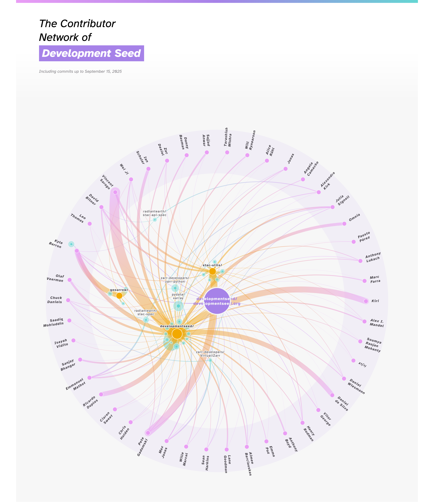

# Development Seed contributor network

The code behind <https://developmentseed.org/contributor-network>.



This visual is derived from the excellent <https://github.com/nbremer/ORCA/tree/main/top-contributor-network>.

## Running

```shell
python -m http.server
```

This will open the page on <http://localhost:8000/>.

## Developing

First, get [uv](https://docs.astral.sh/uv/getting-started/installation/) and set up [.netrc authentication for Github](https://pygithub.readthedocs.io/en/stable/examples/Authentication.html#netrc-authentication).
Then:

```shell
uv sync
rm -rf data  # We don't re-fetch data from Github if it already exists on the local filesystem
uv run python scripts/fetch_data.py
uv run python scripts/build_csvs.py
```

## License

This work was copied-and-modified from <https://github.com/nbremer/ORCA> and is licensed under the same (MPL).
