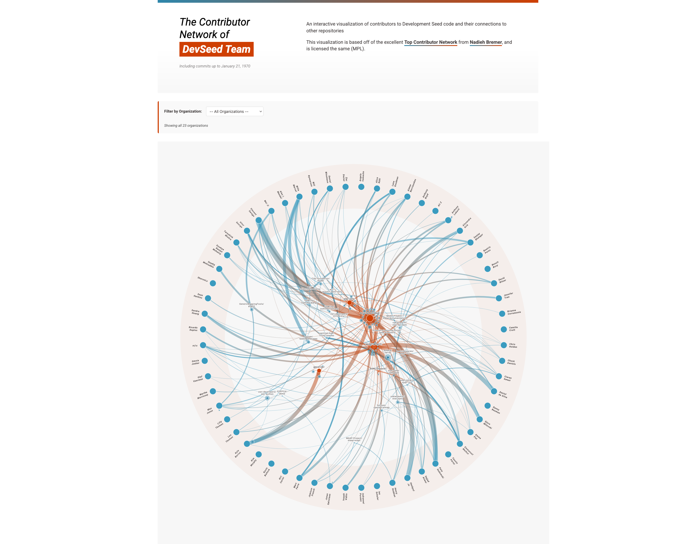

# Development Seed Contributor Network

The code behind <https://developmentseed.org/contributor-network>.



This visual is derived from the excellent [ORCA top-contributor-network](https://github.com/nbremer/ORCA/tree/main/top-contributor-network) by Nadieh Bremer.

## Quick Start

### Prerequisites

- [uv](https://docs.astral.sh/uv/getting-started/installation/) for Python package management
- A GitHub personal access token with `public_repo` scope

### View Locally

```shell
python3 -m http.server 8000
```

Then open <http://localhost:8000/>

## Project Structure

Configuration is split across three files to keep things simple:

| File                | Purpose                                                  |
|---------------------|----------------------------------------------------------|
| `config.toml`       | Title, org name, visualization settings, file paths      |
| `repositories.txt`  | One GitHub repo per line (`owner/repo`)                  |
| `contributors.csv`  | `username,type,name` — type is `core` or `community`      |

### Example `config.toml`

```toml
title = "Contributor Network"
organization = "Development Seed"
description = "An interactive visualization of contributors"

contributors_path = "contributors.csv"
repositories_path = "repositories.txt"

[visualization]
show_community_contributors = true
show_repo_details = true
max_forks_to_display = 10
```

### Example `repositories.txt`

```
developmentseed/titiler
developmentseed/lonboard
NASA-IMPACT/veda-backend
```

### Example `contributors.csv`

```csv
username,type,name
aboydnw,core,Anthony Boyd
gadomski,core,Pete Gadomski
some-contributor,community,Some Contributor
```

## CLI Commands

All commands are run via `uv run contributor-network <command>`.

### `discover from-repositories`

Discover contributors by scanning the repos in `repositories.txt`. Prompts you to classify each new contributor as **core** or **other**, then saves to `contributors.csv`.

```shell
export GITHUB_TOKEN="your_token_here"
uv run contributor-network discover from-repositories
```

Options:
- `--min-contributions N`: Only include contributors with at least N contributions (default: 1)

### `discover from-contributors`

Discover repositories that your contributors have been active in. Optionally appends new repos to `repositories.txt`.

```shell
export GITHUB_TOKEN="your_token_here"
uv run contributor-network discover from-contributors
```

Options:
- `--type [core|all]`: Which contributors to scan (default: core)
- `--min-contributors N`: Minimum contributors to include a repo (default: 2)
- `--limit N`: Maximum repos to output (default: 50)

### `data`

Fetch detailed contribution data from GitHub into JSON files. Reads repos from `repositories.txt` and contributors from `contributors.csv`.

```shell
export GITHUB_TOKEN="your_token_here"
uv run contributor-network data data/
```

Options:
- `--include-community`: Also fetch link data for community (non-core) contributors
- `--fetch-forking-orgs`: Discover which organizations have forked each repo

### `csvs`

Generate the three CSV files the frontend needs from fetched JSON data:

```shell
uv run contributor-network csvs data/
```

Produces `top_contributors.csv`, `repositories.csv`, and `links.csv` inside `data/`.

### `build`

Build the static site into an output directory:

```shell
uv run contributor-network build data/ build/
```

Copies CSVs, JS, CSS, images, and generates `config.json` for runtime use.

### `list-contributors`

List all contributors from `contributors.csv` by category:

```shell
uv run contributor-network list-contributors
```

## Full Workflow

### Starting from scratch (repository-first)

```shell
# 1. Create repositories.txt with your repos (one per line)

# 2. Set your GitHub token
export GITHUB_TOKEN="your_token_here"

# 3. Discover and classify contributors interactively
uv run contributor-network discover from-repositories

# 4. Fetch detailed data from GitHub
uv run contributor-network data data/

# 5. Generate CSVs
uv run contributor-network csvs data/

# 6. Build the site
uv run contributor-network build data/ build/

# 7. Preview locally
cd build/ && python3 -m http.server 8000
```

### Starting from known team (contributor-first)

```shell
# 1. Create contributors.csv with your team (username,type,name)

# 2. Set your GitHub token
export GITHUB_TOKEN="your_token_here"

# 3. Discover repos your team contributes to
uv run contributor-network discover from-contributors

# 4. Fetch detailed data from GitHub
uv run contributor-network data data/

# 5. Generate CSVs
uv run contributor-network csvs data/

# 6. Build the site
uv run contributor-network build data/ build/

# 7. Preview locally
cd build/ && python3 -m http.server 8000
```

Then open <http://localhost:8000/>.

## Development

### Architecture

The visualization code is organized into modular ES6 modules in `js/`:

```
js/
├── config/          # Configuration (theme, scales)
├── data/            # Data preparation and filtering
├── interaction/     # Mouse hover and click handling
├── layout/          # Canvas sizing, positioning, resize
├── render/          # Drawing functions (shapes, text, labels, tooltips)
├── simulations/     # D3 force simulations (owner, contributor, collaboration, community)
├── state/           # State management (filters, interactions)
├── utils/           # Utilities (helpers, validation, formatters, debug)
└── __tests__/       # Unit tests
```

The main entry point is `js/chart.js` which exports `createContributorNetworkVisual`.

### Running Tests

```shell
npm test
```

Tests use Vitest and cover filtering, validation, and utility functions.

### Making Changes

When modifying the visualization:
1. Edit files in `js/`
2. Changes are immediately available in the browser (no build step needed for dev)
3. Run `python3 -m http.server 8000` from the project root and refresh to see updates
4. Run `npm test` to verify changes don't break tests

### Code Quality

```shell
uv sync
uv run ruff check --fix
uv run ruff format
uv run pytest
```

### Automated Rebuilds

We use [workflow dispatch](https://github.com/developmentseed/contributor-network/actions/workflows/build.yml) to rebuild the source data manually.

## Branding

This visualization uses the Development Seed brand colors:
- **Grenadier** (#CF3F02): Primary orange accent
- **Aquamarine** (#2E86AB): Secondary blue
- **Base** (#443F3F): Text color

## License

This work was copied-and-modified from <https://github.com/nbremer/ORCA> and is licensed under the same (MPL).
