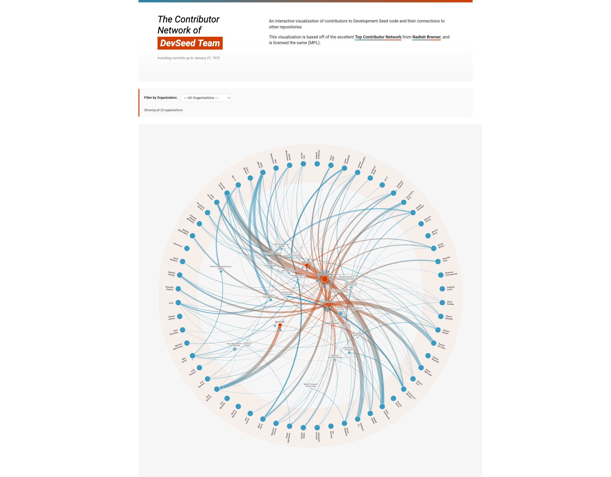

# Development Seed Contributor Network

The code behind <https://developmentseed.org/contributor-network>.



This visual is derived from the excellent [ORCA top-contributor-network](https://github.com/nbremer/ORCA/tree/main/top-contributor-network) by Nadieh Bremer.

## Install the CLI

The `contributor-network` Python CLI can be installed directly from this repository:

```sh
uv tool install git+https://github.com/developmentseed/contributor-network
```

Or with `pip`:

```sh
pip install git+https://github.com/developmentseed/contributor-network
```

## Usage

To view the site locally with hot module replacement:

```sh
npm run dev
```

## Development

Get [uv](https://docs.astral.sh/uv/getting-started/installation/), [Node.js](https://nodejs.org/) 18+, and a GitHub personal access token with `public_repo` scope (e.g. via `gh auth token` if you have the [Github CLI](https://cli.github.com/)).

```sh
uv sync
npm install
```

The build is split into two steps: `contributor-network build` generates the CSVs and `config.json` into `public/data/`, and `npm run build` runs Vite to produce the final static site in `dist/`.

```sh
uv run contributor-network build    # generate data
npm run build                       # build the static site
```

If you've changed the config and need to re-fetch data from the Github API, run this (warning, this takes a while):

```sh
export GITHUB_TOKEN="your_token_here"
uv run contributor-network fetch
```

To list all configured contributors by category:

```shell
uv run contributor-network list-contributors
```

To find new repositories that DevSeed employees contribute to:

```shell
uv run contributor-network discover --min-contributors 2 --limit 50
```

This queries GitHub to find repos where multiple DevSeed employees have contributed, which are not yet in the configuration.

### Full workflow

To update the visualization with new data:

```shell
# 1. Set your GitHub token
export GITHUB_TOKEN="your_token_here"

# 2. (Optional) Discover new repos to add
uv run contributor-network discover --min-contributors 2

# 3. Edit config.toml to add/remove repos or contributors

# 4. Fetch data from GitHub
uv run contributor-network fetch

# 5. Generate data files
uv run contributor-network build

# 6. Build the static site
npm run build

# 7. Preview locally
npm run preview
```

### Tests

```shell
npm test
uv run pytest
```

### Type checking

```shell
npm run typecheck
```

### Lints

```shell
uv run ruff check --fix
uv run ruff format
```

## Configuration

Edit `config.toml` to configure:

- **repositories**: List of GitHub repos to track (format: `"owner/repo"`)
- **contributors.devseed**: Current DevSeed employees (format: `github_username = "Display Name"`)
- **contributors.alumni**: Friends and alumni (commented out by default)

## Branding

This visualization uses the Development Seed brand colors:
- **Grenadier** (#CF3F02): Primary orange accent
- **Aquamarine** (#2E86AB): Secondary blue
- **Base** (#443F3F): Text color

## License

This work was copied-and-modified from <https://github.com/nbremer/ORCA> and is licensed under the same (MPL).
